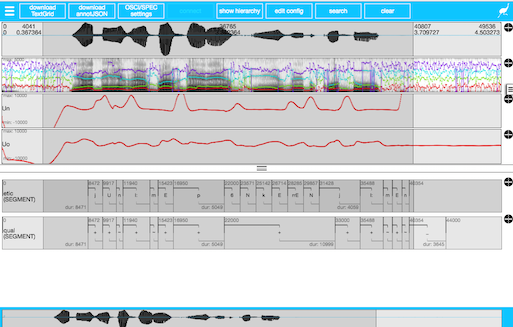

```{r setup, include=FALSE}
require(emuR)
knitr::opts_chunk$set(echo = FALSE)
```

## Opening Existing Databases

First we must load the database:
	* This attaches the SQL database and makes querying fast:
	
```{r include=TRUE, echo = TRUE}
require(emuR)
# Change the path to point to the database
test_DB <- load_emuDB("~/Dropbox/Projects/Emu_Workshop_2/TestDB_emuDB")
```

## Serving the Database
After we ave loaded the database then we can serve it and view the files:
```{r eval=FALSE, include=TRUE, echo = TRUE}
serve(test_DB, autoOpenURL = NULL)
```


## Adding Derived Signal files to the Database
`Test_DB` has some derived signal files 

* For example F0 and formants
* Could add rms or other signals

```{r eval=FALSE, include=TRUE, echo=TRUE}
add_ssffTrackDefinition(emuDBhandle = test_DB, 
												name = "FORMANTS", 
												columnName = "fm",
												fileExtension = "fms")
```

## Perspectives
In order to view the correct data in the Emu WebApp we need to set the correct canvas order using `perspectives`
```{r include=TRUE, echo= TRUE}
list_perspectives(test_DB)
```

## Adding tiers to a Database

Tiers are called `level definitions` in the Emu database:
```{r include=TRUE, echo= TRUE}
list_levelDefinitions(test_DB)
```

## Attribute definitions

Attribute definitions can hold arbitrary information that has is connected with the annotation at that `level`.

```{r include=TRUE, echo= TRUE}
list_attributeDefinitions(test_DB, "utt")
```

## Converting existing databases

```{r existingDB, include=TRUE, echo= TRUE, eval=FALSE}
convert_TextGridCollection(
				dir = "directory with pair of textgrid and wavfile",
				dbName = "name for emudb",
				targetDir = "path to dirctory"
													 )
```


## Wishlist of Features 
 in the Labeller and within Emu R
```{r}
# What are some of the features that you think are missing from emu at the moment?
```

## Workshopping Specific Questions with existing Data

* Are there any questions about your data?

## Some topics for future workshops:

An introduction to [tidy data](http://r4ds.had.co.nz/tidy.html) (Wickham
)

* Why do things this way?
* For reproducable workflows
* To easily visualise and apply appropriate statistical methods

## Visulisation and Statistics

* Most of this will have to be for another workshop...

